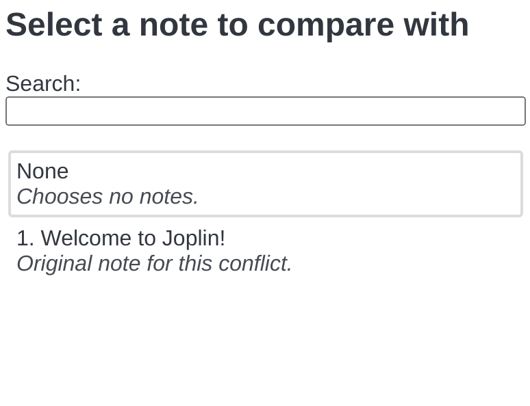

# Joplin Plugin Diff View

A plugin for [Joplin](https://joplinapp.org/) that adds support for comparing notes in the note editor.

This plugin uses [`@codemirror/merge`](https://github.com/codemirror/merge) to show a diff that can be used to compare the content of related notes and to resolve conflicts.

## Desktop setup

- This plugin does not support the Rich Text Editor.
- On desktop, be sure that the legacy Markdown editor is disabled. To do this, go to settings > general > advanced, then uncheck the "legacy Markdown editor" setting.

## Usage

This plugin adds a "compare" button to the desktop and mobile markdown toolbars.

### To compare the current note with another:

1. Click "compare" ().
2. Search for a note ID, note title, or content.
   - The search bar supports the same search syntax as Joplin.
3. Click "OK".

Joplin syncs the ID of the note to be compared with between devices.

### To stop comparing with another note:

1. Click "compare" ().
2. Click "None".  
   
3. Click "OK".
